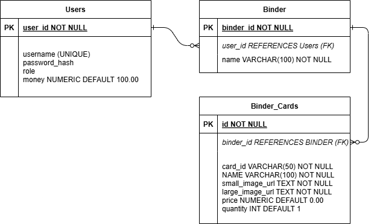

# 🃏 Pokémon TCG Binder-Building Web App 🃏

---


---
## 📖 Overview
A web application that integrates with the [Pokémon TCG API](https://pokemontcg.io/) to allow users to **search for cards, manage personal binders, and conduct trades**.

With this app, Pokémon Trading Card Game (TCG) collectors can **organize collections, track card values, and engage in virtual trading**.
Users can create multiple binders to categorize their cards for deck-building, investment tracking, or general collection management.
The marketplace feature allows authenticated users to buy and sell cards using an **in-app currency system**.
---
### 🔐 Authentication & Security
Authentication is required for actions beyond searching, such as creating binders and buying cards.
- **User authentication is handled via JWT tokens.**
- Tokens are **securely generated and stored** on the server side after login.
- **Spring Security** ensures that protected endpoints require authentication.
---
## 🚀 Live Deployment (Koyeb)
The backend is **deployed on Koyeb**, making it accessible for API calls **without running locally**.  
Use the Postman and API documentation in the project to test the backend.  
[Try it with Swagger UI!](https://sparkling-vivi-angelo-j-code-a0aad5ff.koyeb.app/swagger-ui/index.html)

**Base API URL:**
```plaintext
https://sparkling-vivi-angelo-j-code-a0aad5ff.koyeb.app/
```
---
### 🌍 Public Features (No Authentication Required)
- **Search for Cards by Name (list) or Card ID (single) 🔍**

### 🔒 Authenticated Features (Requires Login)
- **User Authentication 🔐**: Create an account and log in with JWT tokens.
- **Binders 📂**: Create, name, and manage personal collections.
- **Trading System 💰**: Buy and sell cards using in-app currency.
- **Pricing System 🏷️**: Fetch prices via API or set custom values.
- **Admin Features 👀**: Admins can delete users/binders.
---
## 🌐 API Integration
This app integrates with the Pokémon TCG API to retrieve real-time card data while keeping the
database lightweight by storing only essential attributes (ID, name, image URLs, price).


## 💾 Database ERD


---
## 🎯 Key Classes & Interfaces
### 📦 Models
- `User` 👤
- `Card` 🎴
- `Binder` 📂

### 🎮 Controllers ###
- `UserController` 👥
- `AuthenticationController` 🔑
- `BinderController` 📂
- `CardController` 🎴

### 🔧 Services
- `PokemonApiService` 🌐

### 📊 Data Access Objects (DAOs)
- `BinderDao` 📂
- `CardDao` 🎴
- `UserDao` 👤

### 📜 Data Transfer Objects (DTOs)
- `CardDto` 🎴
- `BinderCardDto` 📂
- `CardmarketDto` 🏷️
- `TcgplayerDto` 🏷️
- `BuyCardRequestDto` 🛒

### 🛠️ Utils
- `CardMapper` 🗺️


---
## 🗺️ Future Enhancements
- **Test Suite Updates**: Ensure unit and integration tests align with recent code changes.
- **Pagination Improvements**: Enhance user experience when browsing large sets of cards.
- **Frontend Development**: A user-friendly UI for managing binders and trades.
- **Improved Market System**: Possibly allowing direct trade between users.
---
## 🛠️ Technologies Used
- **Java** ☕
- **Spring Boot** 🌱
- **PostgreSQL** 🐘
- **Pokémon TCG API** 🌐
- **Swagger UI** 📜
- **Vue.js** 🖥️ *(Planned for frontend)*
---
## Author
Developed by **Jordan Opst**.

---

