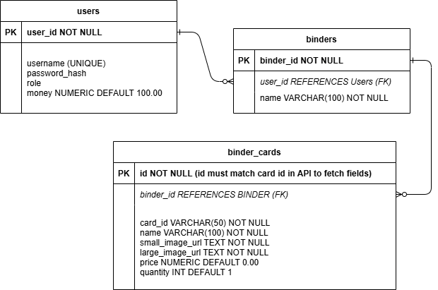

# 🃏 Pokémon TCG Binder-Building Web App 🃏

---


---

## 📖 Overview
A web application that integrates with the [Pokémon TCG API](https://pokemontcg.io/) to allow users to **search for cards, manage personal binders, and conduct trades**.

With this app, Pokémon Trading Card Game (TCG) collectors can **organize collections, track card values, and engage in virtual trading**.
Users can create multiple binders to categorize their cards for deck-building, investment tracking, or general collection management.
The marketplace feature allows authenticated users to buy and sell cards using an **in-app currency system**.

---

### 🔐 Authentication & Security
Authentication is required for actions beyond searching, such as creating binders and buying cards.
- **User authentication is handled via JWT tokens.**
- Tokens are **securely generated and stored** on the server side after login.
- **Spring Security** ensures that protected endpoints require authentication.

---

## 🚀 Live Deployment (Koyeb)
The backend is **deployed on Koyeb**, making it accessible for API calls **without running locally**.  
You can use the Postman collection in the Postman directory and/or the API documentation in the design directory to test the backend.  
[Try it with Swagger UI!](https://sparkling-vivi-angelo-j-code-a0aad5ff.koyeb.app/swagger-ui/index.html)

**Base API URL:**
```plaintext
https://sparkling-vivi-angelo-j-code-a0aad5ff.koyeb.app/
```

---

### 🌍 Public Features (No Authentication Required)
- **Search for Cards by Name (list) or Card ID (single) 🔍**

### 🔒 Authenticated Features (Requires Login)
- **User Authentication 🔐**: Create an account and log in with JWT tokens.
- **Binders 📂**: Create, name, and manage personal collections.
- **Trading System 💰**: Buy and sell cards using in-app currency.
- **Pricing System 🏷️**: Fetch prices via API or set custom values.
- **Admin Features 👀**: Admins can delete users/binders.

---

## 🌐 API Integration
This app integrates with the Pokémon TCG API to retrieve real-time card data while keeping the
database lightweight by storing only essential attributes (ID, name, image URLs, price).


## 💾 Database ERD


---

## 🎯 Key Classes & Interfaces
### 📦 Models
- `User` 👤
- `Card` 🎴
- `Binder` 📂

### 🎮 Controllers ###
- `UserController` 👥
- `AuthenticationController` 🔑
- `BinderController` 📂
- `CardController` 🎴

### 🔧 Services
- `PokemonApiService` 🌐

### 📊 Data Access Objects (DAOs)
- `BinderDao` 📂
- `CardDao` 🎴
- `UserDao` 👤

### 📜 Data Transfer Objects (DTOs)
- `CardDto` 🎴
- `BinderCardDto` 📂
- `CardmarketDto` 🏷️
- `TcgplayerDto` 🏷️
- `BuyCardRequestDto` 🛒

### 🛠️ Utils
- `CardMapper` 🗺️

---

## 🧪 Testing
### 🔹 What’s Tested?
The test suite includes both unit tests and integration tests, ensuring that database interactions, business logic, and API-related data transformations work as expected.

✅ **DAO Integration Tests** (Database-Backed)
- These tests interact directly with the PostgreSQL database, verifying that queries, transactions, and cascading deletions function correctly.

✅ **User DAO** (`JdbcUserDaoTest`)
- Retrieve users by ID and username.
- Prevent duplicate usernames during registration.
- Ensure correct money transactions (buying/selling cards).

✅ ***Binder DAO*** (`JdbcBinderDaoTest`)
- Create, update, and delete binders.
- Fetch binders by user.
- Ensure deleting a binder removes its associated cards.

✅ ***Card DAO*** (`JdbcCardDaoTest`)
- Add and remove cards from binders.
- Handle buying and selling correctly.
- Prevent purchases if a user lacks sufficient funds.
- Prevent selling non-existent cards.

✅ ***Unit Tests*** (Mocked Dependencies & Business Logic)
- These tests use mocked services (e.g., PokemonApiService) to isolate logic without making external API calls.

✅ ***Mocked API Calls*** (JdbcCardDaoTest)
- Uses Mockito to simulate API responses when fetching card details.
- Ensures that price calculations and transaction logic work correctly.

✅ ***DTO Transformations*** (CardMapper)
- Ensures that database objects (Card, BinderCardDto) correctly map to API responses and vice versa.

### 🔹 Running Tests
You can run the test suite from **any Java IDE** that supports JUnit, such as IntelliJ, Eclipse, or VS Code.  
Simply navigate to the `test` package and run individual test classes or the full suite.

---

## 🗺️ Future Enhancements
- **Advanced Search**: Filter by rarity, set, price range, type, or card legality.
- **Improved Market System**: Allow direct trades and sales between users.
- **Frontend Development**: A user-friendly UI for managing binders and trades.


---

## 🛠️ Technologies Used
- **Java** ☕
- **Spring Boot** 🌱
- **PostgreSQL** 🐘
- **Pokémon TCG API** 🌐
- **Swagger UI** 📜
- **Vue.js** 🖥️ *(Planned for frontend)*

---

## 👥 Contributors
This project was created by **Jordan Opst**. Contributions are welcome!

---

